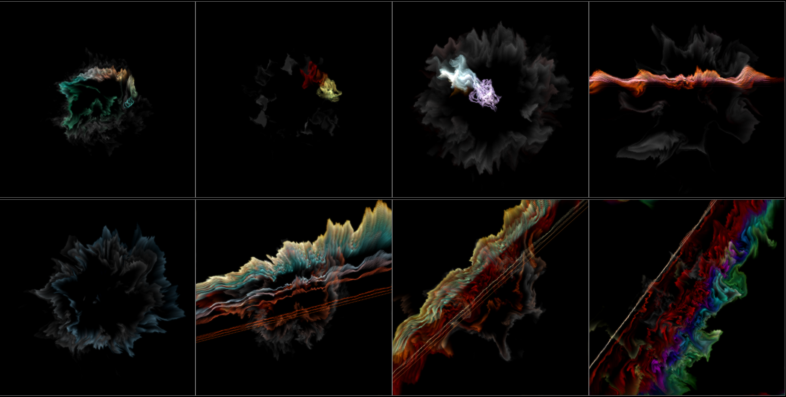

# 🧬 ButterGen

Try it here: [https://buttergen.lanvukusic.com/](https://buttergen.lanvukusic.com/)

## How to

In ordre to use it, load the page and connect your microphone by clicking the only button that exists on the page.  
Audio is used for visualisation only and is not stored / sent anywhere (check the code to verify if you wish)

Website will display a grid of random visualizers based on some preset.  

Click on the **worst** visualizer on the page. This will kill it and replace it with a new child, generated from parents.  

The longer the visualizer stays without being killed (implying you like it the most), higher the chanes of it being selected as a parent when generating new one.

## Gallery

## Current state

App is currently in "beta". First release works but needs some polish.  
Further updates coming soon.

### roadmap

- [ ] Selectable presets
- [ ] Granular controll over evolution
  - [ ] select two to mutate
  - [ ] generate population from single (really cool looking) visualization
- ...
